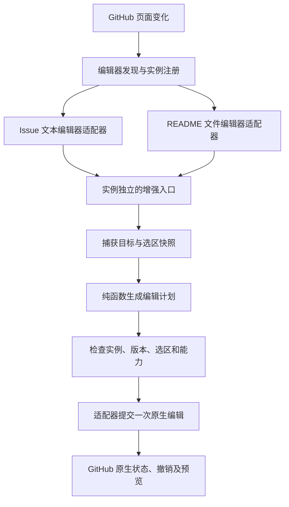

# GitHub 原生 Markdown 增强插件详细设计

状态：设计草案，未实现；2026-09-24。

设计入口：[决策地图](map.md) · [接入证据与限制](research.md) · [术语表](../../CONTEXT.md)。

## 1. 目标与已确定边界

在 GitHub 原生编辑器的按钮区域增加一个“增强 ▾”入口。用户选择提示块、折叠块等操作后，扩展只向该编辑器插入 Markdown；后续编辑、预览、保存和提交仍由 GitHub 完成。

用户已明确：

- 保留 GitHub 原生编辑器，不替换、不重建，不引入富文本编辑器。
- 增强入口放在编辑器按钮区域，通过下拉菜单选择插入内容。
- 覆盖 README 在线编辑和 Issue 编辑；Issue 多个正文输入框分别增强。
- 首版支持 Chrome / Edge。
- 本轮先出设计，后续再实施。

本设计建议：以 GitHub.com 桌面网页为首版目标；先完成五种提示块、折叠块、键盘按键、Diff 代码块。表格、任务清单、脚注及模板作为后续命令扩展。后文涉及功能排序和界面细节均为建议，不视为用户已经批准。

当前仓库只有 Git 元数据，没有提交、业务代码、依赖或项目脚本。本文的目录、类型和验证命令类别均为拟议方案，不代表功能已经存在。

## 2. “不动原有编辑器”的可验证定义

增加入口本身需要添加少量 DOM，因此约束应定义为“不改变现有编辑器的结构和行为”，而不是完全不修改页面 DOM。

允许：

1. 在经过验证的按钮容器中追加扩展自己拥有的节点。
2. 在没有 Markdown 工具栏的文件编辑器顶部操作区域追加入口；若该区域不适合插入，则在同一编辑器上方增加一条仅含增强按钮的轻量操作行。
3. 用户选择命令后，通过该原生编辑器认可的编辑机制完成一次局部文本修改。
4. 对扩展自己的菜单和按钮添加样式、监听器和无障碍属性。

禁止：

- 替换、克隆、重新挂载 textarea、contenteditable 或文件编辑器；移动原有编辑器到新容器。
- 删除、隐藏、重排 GitHub 原有按钮、Write / Preview 标签或提交入口。
- 把编辑器改造成双栏、实时预览或 WYSIWYG；维护第二份常驻正文模型。
- 通过修改 CodeMirror 渲染出来的 DOM 伪装一次编辑；遍历 React 私有内部结构寻找状态。
- 接管原生输入、粘贴、上传、提及、快捷键或表单提交。
- 未经用户选择命令就改正文；自动保存、提交 Issue 或提交仓库文件。

验收必须检查：原生节点身份和顺序保留，原生功能可用，插入操作进入原生撤销历史，卸载扩展节点后正文区域仍独立工作。

## 3. 支持范围与优先级

| 场景 | 首版要求 | 增强入口及目标 |
| --- | --- | --- |
| 新建普通 Issue | 必须 | 正文工具栏，一框一个入口 |
| Issue Form 多个 Markdown 正文框 | 必须 | 每个合格正文框独立入口，不能只匹配第一个 |
| 编辑 Issue 描述、撰写及编辑普通评论 | 必须 | 编辑器出现时挂载，退出编辑时清理 |
| README.md 在线编辑 | 必须 | 文件编辑器自己的顶部操作区域 |
| 新建 `.md` / `.markdown` 文件、其他 Markdown 文件编辑 | 与 README 共用适配；纳入首版验收 | 文件名变化时重新判断是否启用 |
| PR 描述、普通 PR 评论、Discussion | 后续覆盖 | 可复用文本适配器，但未经实测不宣布支持 |
| PR 逐行 Review、批量待提交评论 | 后续独立验证 | 生命周期不同，不凭相似外观承诺兼容 |
| Wiki、GitHub Enterprise、github.dev、Codespaces、移动端 | 首版不覆盖 | 保留以后独立适配的边界 |

非目标字段：标题、搜索、单行 input、只读框、禁用框、非 Markdown 文件、表单代码输入区。Issue Forms 可以把 textarea 设置为代码渲染用途，因此“一框一个按钮”指每个可确认的 Markdown 正文框，而不是页面中所有 textarea。无法确认用途的字段保守跳过。[Issue Forms 官方 schema](https://docs.github.com/en/communities/using-templates-to-encourage-useful-issues-and-pull-requests/syntax-for-githubs-form-schema)

README 是完整首版的发布门槛。可先内部验收 Issue，再验证 README；如果 README 接入尚未通过，不得将 Issue 内测包标成已经完成本需求。

## 4. 页面交互

### 4.1 原生工具栏追加入口

示意仅表示位置关系，不假定 GitHub 当前 DOM 或按钮文字固定：

```text
Problem or Motivation
┌───────────────────────────────────────────────────┐
│ Write  Preview     原有格式按钮……       [增强 ▾]   │
│                                                   │
│ 原生 Markdown 编辑区域                            │
└───────────────────────────────────────────────────┘

Proposed Solution
┌───────────────────────────────────────────────────┐
│ Write  Preview     原有格式按钮……       [增强 ▾]   │
│                                                   │
│ 另一个原生 Markdown 编辑区域                      │
└───────────────────────────────────────────────────┘
```

按钮采用原生风格的边框、字号、圆角和间距，但样式仅作用于扩展节点。按钮显式设置 `type="button"`，避免在 Issue 表单中触发提交。默认文字“增强”，英文界面为“Enhance”，使用本地文案字典。不得靠翻译后的标题文字识别目标框。

首版下拉采用单层分组，五种 Alert 直接列出，避免逐级悬停；从按钮到选中命令为两次点击。

```text
[增强 ▾]
┌─────────────────────────────────┐
│ 提示块                          │
│ ⓘ Note       补充说明            │
│ ◇ Tip        建议与技巧          │
│ ! Important  重要信息            │
│ △ Warning    潜在风险            │
│ ⛔ Caution   严重风险             │
│ ─────────────────────────────── │
│ Details      折叠内容            │
│ Keyboard     键盘按键            │
│ Diff         差异代码块          │
└─────────────────────────────────┘
```

使用固定的小图标和文字同时表达类型，不单靠颜色。菜单展示简短用途，不在菜单中实现 Markdown 渲染器。五种提示块对应 GitHub 当前文档中的类型。[Alerts 官方语法](https://docs.github.com/en/get-started/writing-on-github/getting-started-with-writing-and-formatting-on-github/basic-writing-and-formatting-syntax#alerts)

### 4.2 README 入口

```text
README.md                 原有编辑/预览操作…… [增强 ▾]
┌───────────────────────────────────────────────────┐
│ GitHub 原生文件编辑器                              │
│ # 项目说明                                        │
│                                                   │
└───────────────────────────────────────────────────┘
```

不为 README 补造整套 Issue 工具栏。只追加同一个增强入口，保留文件编辑器自己的光标、滚动、行号、编辑/预览和提交方式。挂载位置由真实页面探测结果决定，不能假定 README 本来就有 `markdown-toolbar`。

### 4.3 菜单与焦点

- 只允许一个菜单展开，但各个实例保有独立入口。
- 打开 A 的菜单时固定目标为 A；切换焦点到 B 的正文时关闭 A 的菜单，不改成“当前最后聚焦的框”。
- Enter / Space 打开；方向键移动；Home / End 定位；Enter 选择；Escape 关闭并回到入口。Tab 关闭菜单并遵循正常焦点顺序。
- 执行成功后焦点返回原生编辑器，选中占位内容；取消不会改正文。
- 点击页面外侧关闭。原生 Preview 激活、编辑器移除、路由切换或开始输入法组合时关闭菜单；Preview 下不主动切换到 Write。
- 菜单采用 `aria-haspopup="menu"`、`aria-expanded`、菜单项角色及 roving tabindex；仅在菜单内处理方向键，不注册全局编辑快捷键。
- 菜单通过扩展自有浮层定位，在窄屏自动翻转或限制高度，跟随滚动重新定位，不遮住关键原生操作。
- 不可用状态提供简短、可被辅助技术读取的原因，例如“当前编辑器暂不支持增强插入”。不弹出反复打断输入的通知。

## 5. 插入命令与文本规则

### 5.1 首版必需命令

| 命令 | 无选区 | 有选区 | 完成后的选区 |
| --- | --- | --- | --- |
| Note / Tip / Important / Warning / Caution | 插入类型头及“在这里输入内容” | 将选中文字每行包为引用正文，保留行内容和空行 | 无选区时选中提示正文；有选区时光标移到插入块后 |
| Details | 插入 summary 和正文占位 | 选中文字放在折叠正文中 | 选中 summary，方便先命名折叠块 |
| Keyboard | 插入 `<kbd>按键</kbd>` | 单行选区转义后包入 `<kbd>` | 无选区时选中“按键”；有选区时光标移到标签后 |
| Diff | 插入 `diff` 围栏和两行示例 | 将选中文字原样放入 `diff` 围栏 | 无选区时选中示例内容；有选区时光标移到代码块后 |

生成示例：

````markdown
> [!NOTE]
> 在这里输入内容

<details>
<summary>展开查看</summary>

在这里输入内容

</details>

<kbd>Ctrl</kbd>

```diff
- 原内容
+ 新内容
```
````

Details 的标签与正文之间保留空行；Keyboard 将选区中的 `&`、`<`、`>` 转义。多行 Keyboard 选区禁用该命令并提示选择单行文字，不自行合并用户行内容。

Diff 不把普通选中文字擅自改成真实差异，不自动猜测哪些行是增加或删除；围栏长度至少为 3，且长于选中文字里最长连续反引号，避免意外截断代码块。

### 5.2 统一位置规则

1. 使用打开入口前捕获的目标实例和选区；支持鼠标点击与键盘焦点切换两条路径。
2. 无选区就在原光标处插入；有选区时只替换选中范围。范围以原生编辑器的 UTF-16 偏移表示。
3. 块级命令在边界补足段落空行，最多补至两个换行，不删除用户已有空行。选区在一行中间时拆分前后文本为独立段落，其他文字完整保留。
4. 行内 Keyboard 不增加段落空行。
5. 仅规范化生成内容的换行到文档约定，不格式化整篇文档；未被替换的正文逐字保持。
6. 不默默扩大到整行，不改写未选中文本。若输入已有 `>` 前缀，不把它猜测为同类型提示块并自动剥离；首版是插入/包裹操作，不是智能格式转换。
7. 块命令在已识别的代码围栏内部、嵌套列表或引用上下文中不保证成为顶层可渲染块：检测到这些情况时禁用并提示移到独立段落。轻量上下文检查只覆盖明确情况，不宣称是完整 Markdown 解析器。
8. 使用原生 Preview 查看最终效果，不调用远端 Markdown 渲染接口。合法源码插入与最终渲染需分别验收。

### 5.3 后续命令

| 命令 | 建议行为 | 延后理由或约束 |
| --- | --- | --- |
| Table | 默认插入两列两行空表格 | 原生已有部分插入能力；不自动把任意文本推断成表格 |
| Task List | 无选区插入任务项；多行选择逐行添加；已有任务前缀保留 | 避免与原生按钮重复，可作为可选菜单项 |
| Footnote | 光标处放引用，文档末尾放定义；扫描已有引用/定义避免重名 | 两处修改必须归为一次撤销；依赖适配器的原子多范围编辑能力，不能做两次独立写入冒充一个命令 |
| 常用模板 | 本地固定文本片段；如后续自定义，单独设计管理页 | 首版不引入变量语言、脚本模板或云同步 |

脚注首版不列入必需交付，防止为了语法快捷项破坏撤销历史。此排序是建议，可在设计评审中调整。

## 6. 架构：发现、适配、命令、界面分离



不额外搭建应用框架。核心模块职责：

| 模块 | 职责 | 不负责 |
| --- | --- | --- |
| Discovery | 识别合格编辑器和挂载点，处理新增、移除、重建 | 不生成 Markdown，不改正文 |
| Registry | 维护实例、入口、生命周期清理 | 不保存跨页面草稿 |
| Adapter | 读目标/选区，报告能力，提交局部原生编辑 | 不定义菜单内容 |
| Commands | 根据输入生成确定性的文本编辑计划 | 不访问 DOM、浏览器 API 或网络 |
| Menu | 展示命令、焦点、键盘导航、定位 | 不根据全局焦点猜目标 |
| Diagnostics | 本地报告适配器名、原因码、版本 | 不记录正文、选区内容、Cookie 或完整私有仓库 URL |

只有文件编辑器确需访问页面运行环境时才启用受限的 MAIN world 桥接。该桥接不应扩散到命令或菜单层。

### 6.1 核心契约（设计伪代码）

```ts
type EditorKind = 'issue-markdown' | 'file-markdown';

interface EditorSnapshot {
  instanceId: string;
  documentKey: string;       // 页面/文件/实例身份，内存内使用
  revision: string;          // 适配器版本戳，不能只比较文字长度
  text: string;              // 本次动作临时读取，不落盘
  selection: { from: number; to: number };
  newline: '\n' | '\r\n';
}

interface TextEdit {
  from: number;
  to: number;
  insert: string;
}

interface EditPlan {
  expectedRevision: string;
  edits: TextEdit[];          // 原始快照坐标；排序、不重叠
  nextSelection: { from: number; to: number }; // 编辑后坐标
}

interface EditorAdapter {
  readonly kind: EditorKind;
  capabilities(): {
    nativeUndo: boolean;
    atomicMultiEdit: boolean;
    singleSelection: boolean;
  };
  isWritable(): boolean;
  capture(): EditorSnapshot | null;
  apply(plan: EditPlan): Promise<
    { ok: true } |
    { ok: false; reason: 'stale' | 'unavailable' | 'unsupported' }
  >;
  focus(): void;
  dispose(): void;
}
```

`nativeUndo` 表示该适配路径已通过对应浏览器的验证，不是运行时检查“存在一个方法”就能返回 true。首版仅支持单选区；README 多光标时禁用命令，不能把多个光标默默折叠为一个。

插入前再次核对实例仍连接页面、文件和路由未变、可编辑、非预览、非输入法组合、内容版本与选区未失效。失败时不写入，提示重新选择。不要在异步等待后套用旧偏移。

## 7. Issue 多输入框适配

### 7.1 找到正确实例

按可靠性由高到低定位：

1. 已验证工具栏的 `for` 属性与 textarea `id` 等明确关系。
2. 已验证局部 Markdown 编辑器容器中，唯一正文输入与唯一按钮区的关联。
3. 已知页面变体的专用识别器，同时验证字段类型、可写性、编辑模式和唯一性。

不能仅凭类名中带 `textarea`、placeholder 文字或“离工具栏最近”就绑定。多个候选无法消歧时跳过，不退回 `document.querySelector('textarea')`。

GitHub 开源的 Markdown toolbar 是 textarea 格式工具，可作为关联和编辑行为的参考；其组件文档不是 GitHub.com 对第三方扩展的稳定接入承诺。[官方组件源码](https://github.com/github/markdown-toolbar-element)

### 7.2 生命周期

- 初始扫描一次，然后用 `MutationObserver` 合并处理变化区域，避免每次输入全页扫描。
- 只观察所需的节点新增/移除和少数状态属性；不订阅整页每个文本变化。
- `WeakMap<Element, Instance>` 去重；需要可遍历清理的实例集合必须及时移除，避免强引用泄漏。
- 每次挂载只创建一个带扩展所有权标记的入口，重复初始化不能生成重复按钮。
- GitHub 重绘工具栏时允许恢复一次挂载；持续相互删除或重绘则停用当前实例，不能与 React 重绘循环争抢 DOM。
- 对路由变化、编辑器替换和模式变化关闭菜单并失效快照；不依赖某一个私有 SPA 事件。浏览器后退、前进及页面恢复均需覆盖。
- 实例移除后清理事件、浮层、观察器和注册表；其他框继续工作。

### 7.3 写入与撤销策略

“设置 textarea.value 再派发 input”不足以证明成功：可见值可能更新，但框架状态、原生撤销或草稿状态不一定同步。

优先调查 GitHub 当前使用的文本插入实现；在隔离的 textarea 适配器里验证保留撤销的原生编辑路径。`execCommand('insertText')` 仅作为可能的兼容路径研究，它已弃用，不能作为长期稳定承诺。`setRangeText` 可用于范围计算验证，但不能仅凭写入结果就宣称保留原生撤销。

放行条件必须同时满足：目标内容正确、原生预览读取新内容、再次输入不回退、一次撤销恢复操作前正文、一次重做恢复插入、没有重复 input 导致的双写、输入法可继续工作。若没有任何路径通过，暂停该适配器的直接插入，修复接入；不得通过维护全局自定义撤销栈接管编辑器。

## 8. README 文件编辑器适配

### 8.1 先确认真实编辑实现

README 文件编辑器与 Issue textarea 分开识别和验证。GitHub 官方文件编辑文档确认使用 CodeMirror，但没有提供版本、实例访问或第三方扩展接口保证；目标账号当前页面仍需实测，不得以 `.cm-content` 的存在推导可写 API 已可访问。[GitHub 编辑文件文档](https://docs.github.com/zh/repositories/working-with-files/managing-files/editing-files)

识别链：确认当前处于仓库文件编辑/新建流程 → 读取当前文件名和 Markdown 类型 → 识别编辑器类型及受支持版本 → 查找已验证的实例访问方式 → 报告能力 → 挂载入口。

新建文件时不能只依赖 URL 判断后缀；文件名输入变化后重新评估。README 以外的 `.md` 使用相同规则，不做文件名硬编码。

### 8.2 可行接入顺序

1. 若页面提供实际可访问的编辑实例及事务接口，使用其局部替换、选区和撤销能力。
2. 若实例仅在页面运行环境可获取，采用打包随附、权限受限的 MAIN world 适配模块，通过具体且经过验证的实例发现方式调用事务。
3. 若只有渲染 DOM、隐藏输入代理或不可访问的内部实例，标记未支持；不能直接改 DOM、模拟可信键盘事件或写隐藏 textarea 冒充文件更新。

MAIN world 只解决运行环境隔离，不会自动公开闭包中的编辑实例。使用 CodeMirror 公共事务 API 的文档，只能说明拿到正确实例后的能力，不能证明 GitHub 页面允许取得该实例。

不能从 `.cm-content.textContent` 读取完整文件：编辑器可能只渲染视口附近内容。也不额外打包另一份 CodeMirror 后假定能跨运行时取用实例或历史注解；具体版本和事务分组需要随实际页面验证。[CodeMirror 官方源码](https://github.com/codemirror/view/blob/main/src/editorview.ts)

### 8.3 如需桥接时的协议

- 限定固定动作：探测能力、捕获快照、应用文本编辑；不提供执行脚本、任意属性访问或任意 API 转发。
- 消息包含协议版本、会话关联 ID、请求 ID、实例 ID、版本戳；校验来源窗口、origin、字段类型、大小上限和坐标范围，拒绝重复写请求。
- 关联 ID 用于串联请求和避免串框，不是能隔离恶意同页脚本的认证秘密。
- MAIN world 不持有扩展权限，不读取 Cookie、Token 或网络凭据；扩展侧不代理任意网络、存储或标签页操作。
- 快照只在菜单操作期间保留在内存中；切换页面或关闭实例后释放。
- 写操作提交前同步重验版本和目标；提交后返回结果。若发生超时，先查询请求状态，禁止盲目重试造成重复插入。
- 尚未执行的过期请求直接丢弃。已执行但回执丢失的请求按请求 ID 去重；不能在不确定状态下自动回滚用户后续输入。

若无法在“不替换、不接管”的约束内实现可靠 README 写入，这是实施阻塞项，应明确报告。手动复制片段可以作为以后独立的辅助功能，但不算完成自动插入 README 的要求。

## 9. 扩展结构与权限

建议使用 TypeScript、Manifest V3、轻量打包器（例如 Vite）、Vitest 和 Playwright。开发开始时再核对依赖当前稳定版本并锁定版本；本轮不安装依赖。

初期不引入 React，不引入 ProseMirror、Tiptap 或自带 CodeMirror；增强浮层的规模不需要额外编辑器或应用运行时。

拟议结构：

```text
src/
  content.ts
  discovery.ts
  registry.ts
  adapters/
    types.ts
    textarea.ts
    file-editor.ts
  commands/
    types.ts
    alerts.ts
    details.ts
    keyboard.ts
    diff.ts
  ui/
    enhance-menu.ts
    styles.css
    messages.ts
  bridge/                  # 仅 README 验证确有需要时增加
    protocol.ts
    main.ts
tests/
  commands/
  fixtures/
  integration/
  e2e/
manifest.json
```

权限建议：

- 静态 content script 仅匹配 `https://github.com/*`，在 `document_idle` 运行并禁用 iframe 全量注入。较宽路径用于兼容站内导航，实际处理由页面和编辑器识别器限定。
- 首版不需要 GitHub Token、GitHub API、后台服务、云服务、剪贴板读写、`tabs`、`cookies` 或 `<all_urls>`。
- 不因使用静态 content script 就机械添加 `scripting` 权限；若桥接方案需要权限，实施前根据官方 API 重新核对最小集合。
- 默认不持久化正文、选区和快照，不上报使用数据。首版没有设置需求时不申请 `storage`；以后确有用户偏好设置再加。
- 扩展脚本、图标和样式随包发布，不加载远程代码。

样式使用扩展命名空间，GitHub 主题变量作为可选值并提供回退；禁止覆盖通用 `button`、`textarea`、`[role=toolbar]` 样式。暗色、高对比、200% 缩放、窗口变窄均需验证。

## 10. 不可用状态与兼容性维护

| 情况 | 行为 |
| --- | --- |
| 找不到可靠目标或字段用途不明 | 不挂载入口，不猜测写入 |
| 识别了目标但未通过事务/撤销能力验证 | 显示不可用原因或不提供命令；记录原因码 |
| 用户进入 Preview、只读或禁用状态 | 关闭菜单，入口隐藏或禁用，不强制切模式 |
| 菜单期间原生内容或选区已改变 | 放弃旧快照，提示重新打开 |
| 目标节点卸载或文件切换 | 清理当前实例，丢弃旧请求 |
| 单个适配器异常 | 停用该实例，其余实例和原生编辑继续工作 |
| 另一扩展替换了原生编辑器 | 不继续套用原生适配器，不抢回编辑器 |
| GitHub DOM 改版 | 更新独立识别器和实页夹具，原生页面仍可使用 |

没有自动修复页面结构的兜底策略。识别器按页面类型分开维护；兼容性记录包含验证日期、浏览器版本、GitHub 页面变体和支持能力，不能只写“支持 GitHub”。

## 11. 验证与完成标准

### 11.1 命令层

测试真实文本边界：空文档、行首/行中/行尾、正向和反向选区、多行与空行、Unicode、不同换行、已有反引号、HTML 转义。断言内容、下一选区和范围外文字保持，而不是仅重复实现步骤。

### 11.2 本地浏览器集成

用脱敏夹具覆盖传统工具栏、受控 textarea、多框表单、动态评论编辑器和文件编辑器适配契约。重点验证事件和生命周期；本地夹具不能证明 GitHub 线上页面一定兼容。

| 验收项 | 通过条件 |
| --- | --- |
| 三个 Issue 正文框 | 三个入口；在第二框选择命令只改第二框，其他框和选区不受影响 |
| 懒加载及重绘 | 重复展开/关闭编辑器、切标签和站内导航后无重复按钮、旧浮层或监听器泄漏 |
| 原生节点保留 | 不替换 textarea/编辑器；不删除、移动或重排原有按钮与标签 |
| 选区 | 点击按钮不丢选区；键盘进入菜单也保持来源；过期位置不写入 |
| 原生历史 | 先输入 A，增强插入 B，撤销恢复 A，重做恢复 B；之后正常输入可继续独立撤销 |
| 输入法 | 中文组合输入期间不插入、不截断组合；组合结束后可用 |
| 非目标字段 | 标题、搜索、代码 textarea、只读/禁用字段没有增强入口 |
| 原生交互 | 格式按钮、Write/Preview、提及、引用、上传入口、提交快捷键不被拦截 |

### 11.3 真实 GitHub 验收（实施阶段必须做）

Chrome 与 Edge 分别验证：普通 Issue、多 Markdown 框且含代码字段的 Issue Form、编辑已有正文/评论、README 中部选区、新建 Markdown 文件、编辑/预览切换及前进/后退。记录具体浏览器版本和日期。

README 额外验证：事务改变实际文档模型；滚动至长文件未渲染部分后插入正确；原生 Preview 读取完整新内容；撤销/重做保留文件其余内容；文件改名和路由切换不会串到旧文件。

实页测试使用隔离的测试仓库和非敏感草稿；自动化默认不点提交或保存。需要验证真实持久化时，在明确授权的测试目标上另做一次提交验证，不能在用户正在编辑的业务草稿中测试。未测提交持久化时在报告中单独注明。

### 11.4 本轮已验证与未验证

- 已检查：仓库为空，无现有源码和用户修改需要迁移；参考对话中的核心诉求；相关一手文档的能力边界。
- 本轮只产出设计文档；检查本地文档链接、状态一致性、文本格式和文件变更范围，不以文档检查替代功能验证。
- 尚未验证：目标账号 GitHub 实页 DOM、README 实例可访问性、textarea 原生历史、框架状态同步、Chrome/Edge 实际端到端表现。本文不将这些写成已实现能力。

## 12. 实施顺序及放行点

| 阶段 | 工作与交付 | 进入下一步条件 |
| --- | --- | --- |
| A：接入可行性验证 | 最小扩展探针；一个 Issue、三个输入框的 Issue Form、README；记录真实识别和写入路径 | 两类编辑器都能局部插入、预览同步、一次撤销/重做；保留原生结构 |
| B：最小纵向功能 | 一个 Note 命令、实例注册、增强按钮、选区与生命周期 | 真实页面中端到端工作，不串框、不重复挂载 |
| C：菜单和全部首版命令 | 五种 Alert、Details、Keyboard、Diff；主题及无障碍 | 命令边界和键盘交互通过，README 与 Issue 行为一致 |
| D：发布候选 | Chrome/Edge 打包、权限审查、验收记录、基于实现编写安装 README | 必需场景实测通过，兼容性与未支持项如实记录 |
| E：后续增强 | 表格、任务清单、脚注、模板；PR/Discussion | 每个能力和场景单独验收再宣称支持 |

阶段 A 必须同时探查 README，不能等完整 Issue 插件写完才发现文件编辑器无法接入。不预设需要后台进程、设置页或大量适配抽象；只有证据说明必要时才增加。

本设计的核心发布标准：用户可在 README 和任意合格 Issue 正文框中选择增强项，内容只进入对应原生编辑器，并继续使用原有编辑、预览和撤销行为。任何必需场景未达成，都应明确保持未完成状态。
