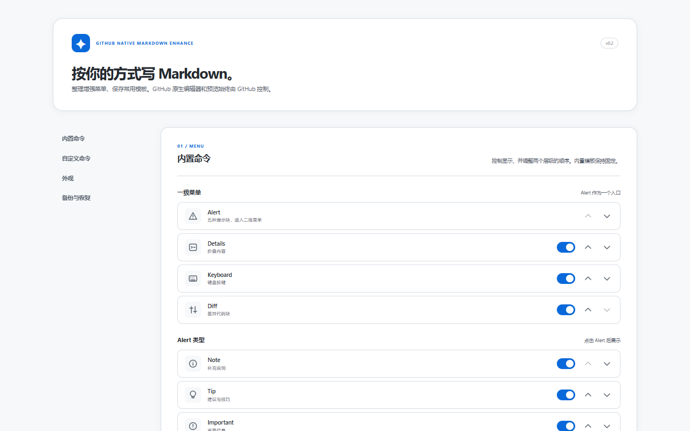

# GitHub Enhanced Plugins

[](https://github.com/Super-YYQ/github-enhanced-plugin) [](LICENSE)  

这个仓库收纳独立的 GitHub 浏览器增强插件。每个插件有自己的 Manifest、源码、测试、文档和构建目录，可以单独安装与发布。当前只包含一个插件：

| 插件 | 用途 | 状态 |
| --- | --- | --- |
| [GitHub Native Markdown Enhance](plugins/native-markdown-enhance/README.md) | 在 GitHub 原生 Issue 与 Markdown 文件编辑器中插入常用 Markdown，不替换编辑器 | `0.2.0`，本地加载测试；尚未上架商店 |



图为已构建扩展在 Chromium 中运行的选项页。菜单和自定义命令的更多截图见[插件说明](plugins/native-markdown-enhance/README.md#界面截图)。

## 获取与安装

目前没有 Chrome Web Store 或 Edge Add-ons 的安装链接。使用 Node.js 24（已验证 `24.14.0`）在仓库根目录构建：

```powershell
npm ci
npm run build
```

在 Chrome 的 `chrome://extensions` 或 Edge 的 `edge://extensions` 打开开发者模式，选择“加载已解压的扩展程序”，目录选 `plugins/native-markdown-enhance/dist/`。如果此前加载的是旧的仓库根目录 `dist/`，请先在旧扩展选项页**导出设置 JSON**，再移除旧开发版、加载新目录并导入设置；目录变化可能使浏览器分配新的扩展 ID，旧的本地配置不会自动迁移，也要避免两个副本同时注入按钮。插件的功能、设置、适配范围与验证情况见其[独立 README](plugins/native-markdown-enhance/README.md)。

## 仓库结构

```text
plugins/
  native-markdown-enhance/
    manifest.json       # 独立的 Manifest V3 扩展
    src/                # 扩展代码与界面
    tests/              # 插入、设置与编辑器测试
    assets/             # 扩展图标
    docs/               # 插件设计、验收与实际界面截图
    dist/               # 构建后生成；不提交
docs/research/           # 仓库层面的发布调研
```

根目录是 npm workspace 入口。`npm run build`、`npm run typecheck` 与 `npm test` 会运行各插件对应的脚本；也可用 `npm run build --workspace github-native-markdown-enhance` 只构建当前插件。新增插件时在 `plugins/` 下建立独立目录与 Manifest，并更新上面的插件索引。

## 发布与许可证

当前插件具备制作 Chrome Web Store 上传包的基础，但**还没有发布**。商店图文素材、最终 GitHub 实页验收、开发者账号与后台隐私披露仍需完成；详见[Chrome Web Store 发布调研](docs/research/chrome-web-store.md)。仓库中的其他插件将来应分别构建和上架。

本仓库代码以 [MIT License](LICENSE) 发布。扩展的数据处理说明见[插件隐私说明](plugins/native-markdown-enhance/PRIVACY.md)。
