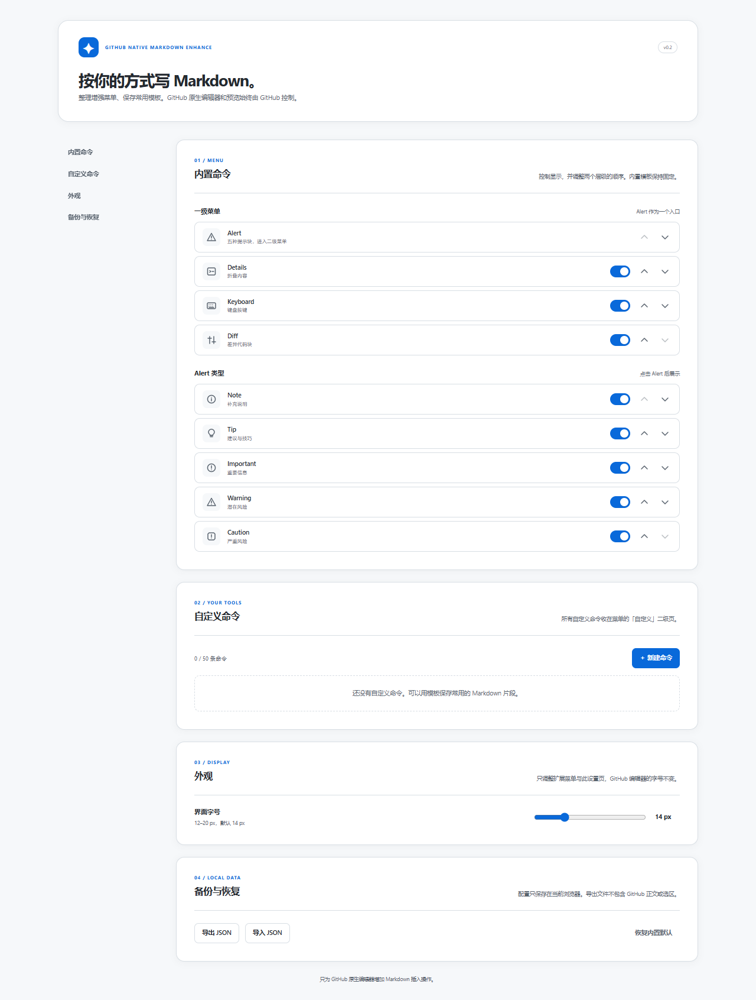
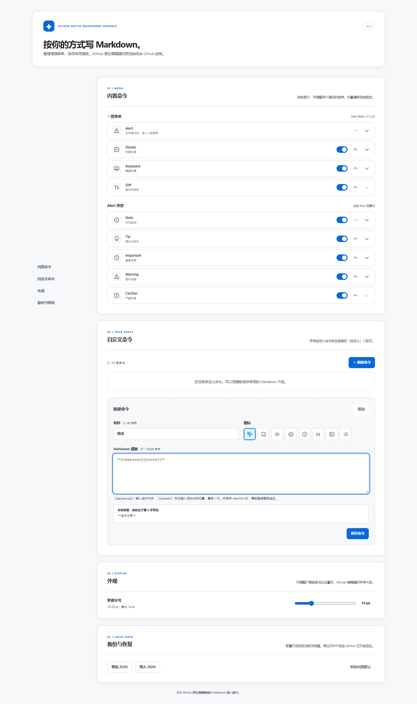
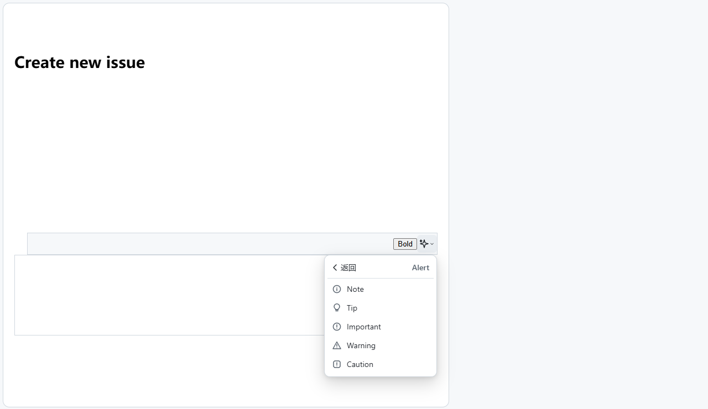

# GitHub Native Markdown Enhance

[](../../LICENSE)  

为 GitHub 原生 Markdown 编辑器添加一个图标菜单，选择命令后把 Markdown 插入**当前**编辑框。GitHub 自带的 Write / Preview、文件预览、撤销与提交操作保持原样，扩展不替换编辑器。

本插件是 [GitHub Enhanced Plugins](../../README.md) 仓库中的一个独立扩展。当前版本 `0.2.0` 可作为本地加载扩展使用，尚未在浏览器商店发布。

## 功能

- Issue 正文栏与多字段 Issue Form：每个 Markdown 编辑框各有一个入口，命令只作用于对应编辑框。
- `.md` / `.markdown` 文件编辑页：包括 README 编辑与新建 Markdown 文件。
- 插入五种 GitHub Alert（Note、Tip、Important、Warning、Caution）、Details 折叠块、Keyboard 按键标签和 Diff 代码块。Alert 类型收在同一二级菜单。
- 选中正文后包裹或替换选区；菜单可用键盘方向键、Home / End、Enter 和 Escape 操作。
- 在扩展选项页隐藏、排序内置命令，管理自定义 Markdown 模板，调整扩展界面字号，并导入或导出 JSON 配置。

例如选择 **Note**，会在当前光标处插入：

```markdown
> [!NOTE]
> 在这里输入内容
```

## 界面截图

下图是已构建扩展在 Chromium 中运行的**真实选项页**，并非设计稿。





下图是加载同一扩展后，在**本地 Issue 测试页**操作 Alert 二级菜单的实测画面；该测试页不是 github.com，不能当作 GitHub 实页验收证据。



## 本地安装

需要 Node.js 24（已验证 `24.14.0`）。在[仓库根目录](../../README.md)执行：

```powershell
npm ci
npm run build
```

构建输出位于 `plugins/native-markdown-enhance/dist/`。打开 Chrome 的 `chrome://extensions` 或 Edge 的 `edge://extensions`，开启开发者模式，选择“加载已解压的扩展程序”，指定该 `dist/` 目录。如果之前加载过仓库根目录的旧 `dist/`，先从旧扩展选项页导出设置 JSON，再移除旧版、加载新目录并导入设置；新路径可能产生不同的扩展 ID，原有本地配置不会自动迁移。修改源码后重新构建并在扩展管理页重新加载。

## 使用与设置

在 Issue 正文栏或 Markdown 文件编辑器中放置光标，也可以先选中文字。点击对应的魔杖图标，在弹出菜单中选择命令。插入后仍可使用 GitHub 原生预览与撤销。块级命令需要在顶层段落使用；若光标位于引用、列表或代码围栏中，扩展会提示更换插入位置。

点击浏览器工具栏中的扩展图标，或从扩展管理页进入“选项”。网页菜单中没有设置入口。设置在当前浏览器配置文件内作用于所有 GitHub 仓库；全部命令隐藏时，网页增强按钮不显示，仍可从扩展图标打开设置。

自定义模板支持 `{{selection}}`（选中文字）和最多一个 `{{cursor}}`（插入后光标位置）。例如 `**{{selection}}{{cursor}}**` 会包裹选区；未写 `{{selection}}` 时会替换选区。自定义命令最多 50 条，名称最多 40 字符、模板最多 10 KB；只可选择扩展自带图标，不执行用户脚本。内置命令可以隐藏和排序，不能删除或改写其 Markdown 模板。

扩展菜单与选项页字号范围为 12–20 px，默认 14 px；GitHub 编辑器字号不受影响。配置使用 `chrome.storage.local` 保存在当前浏览器，不跨设备同步；卸载前可导出 JSON 备份。

## 支持范围与验证

内容脚本仅匹配 `https://github.com/*`。目前针对 Issue Markdown 正文栏和 GitHub 文件编辑页；PR、Discussion、Wiki、github.dev、GitHub Enterprise 和移动端未列入当前适配范围。

`0.1.0` 曾在 Chrome 的真实 GitHub Issue Form 与 README 草稿中验证插入、预览和撤销；`0.2.0` 已验证完整 Manifest V3 包加载、选项页和本地 Issue 测试页。`0.2.0` 的真实 GitHub 页面与 Edge 实页仍待复验。详见[首版验收记录](docs/project/acceptance.md)与[本版验收记录](docs/project/acceptance-0.2.0.md)。

## 开发

在仓库根目录执行：

```powershell
npm run typecheck
npm test
npm run build
npm run fixture
```

`npm run fixture` 在 `http://127.0.0.1:8765/owner/repo/edit/main/README.md` 提供 CodeMirror 测试页，在 `/owner/repo/issues/new` 提供多输入框测试页。测试页不能代替 GitHub 实页验证。

扩展只申请 `storage` 权限，用于保存本地设置；不需要 GitHub Token。数据处理详见[隐私说明](PRIVACY.md)。项目资料见[文档索引](docs/project/README.md)和[术语](CONTEXT.md)。

## 许可证与上架

代码以仓库根目录的 [MIT License](../../LICENSE) 发布。Chrome Web Store 当前尚未上架；发布要求与未完成项见[商店发布调研](../../docs/research/chrome-web-store.md)。
